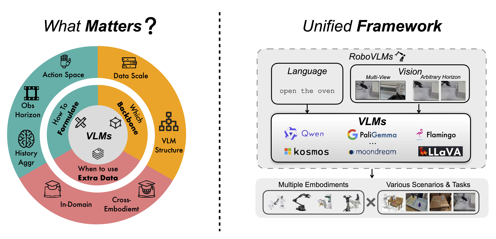
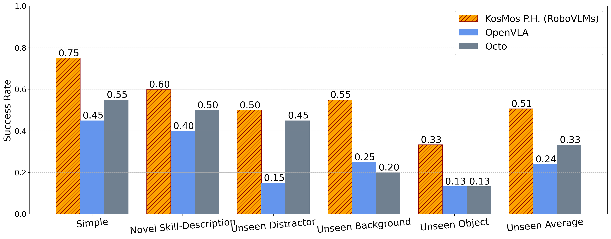

#  | *RoboVLMs* | Towards Generalist Robot Policies: <br>What Matters in Building Vision-Language-Action Models

<a href="https://arxiv.org/abs/2412.14058" target="_blank">
    
</a>
<a href="https://robovlms.github.io/" target="_blank">
    
</a>
<a href="https://huggingface.co/robovlms/RoboVLMs" target="_blank">
    
</a>
<a href="https://huggingface.co/datasets/robovlms/bytedance_robot_benchmark_20" target="_blank">
    
</a>
<br>
<a href="https://www.python.org/" target="_blank">
    
</a>
<a href="https://pytorch.org/" target="_blank">
    
</a>

<div align="center">
    <br>
<div style="text-align: center;">
    <a href="https://scholar.google.com/citations?hl=zh-CN&user=laOWyTQAAAAJ"  target="_blank">Xinghang Li</a><sup>*</sup> &emsp;
    <a href="https://github.com/LPY1219"  target="_blank">Peiyan Li</a> &emsp;
    <a href="https://minghuanliu.com/"  target="_blank">Minghuan Liu</a><sup>*</sup> &emsp;
    <a href=""  target="_blank">Dong Wang</a> &emsp;
    <a href=""  target="_blank">Jirong Liu</a> &emsp;
    <br>
    <a href="https://bingykang.github.io/"  target="_blank">Bingyi Kang</a> &emsp;
    <a href="https://yusufma03.github.io/"  target="_blank">Xiao Ma</a> &emsp;
    <a href="https://www.taokong.org/"  target="_blank">Tao Kong</a><sup>&dagger;</sup> &emsp;
    <a href="https://zhanghanbo.github.io/"  target="_blank">Hanbo Zhang</a><sup>*</sup><sup>&dagger;</sup> &emsp;
    <a href="https://sites.google.com/site/thuliuhuaping/home"  target="_blank">Huaping Liu</a><sup>&dagger;</sup> &emsp;
    <br>
    <p style="text-align: center; margin-bottom: 0;">
        <span class="author-note"><sup>*</sup>Project lead</span>&emsp;
        <span class="author-note"><sup>&dagger;</sup>Corresponding author</span>
    </p>
<br>
<p style="text-align: center;">
    Tsinghua University &emsp; ByteDance Research &emsp; CASIA MAIS-NLPR <br>
    Shanghai Jiao Tong University &emsp; National University of Singapore</p>
</div>
</div>

<hr>

<p>
    
</p>

## Updates
- [12/11/24] 🔥 Multi-modal foundation models [blast](https://github.com/BradyFU/Awesome-Multimodal-Large-Language-Models/tree/Evaluation), but how will they help robots? We have released RoboVLMs to help the community on this! RoboVLMs is a flexible codebase that allows integrating most of VLMs within 30 lines of codes. We also release the strongest VLA model (driven by KosMos VLM backbone). See our technical report at [here](https://robovlms.github.io).

## Contents
- [Installation](#installation)
- [VLA Benchmarks](#vla-benchmarks-comparison)
- [VLM Integration Tutorial](#vlm-integration-tutorial)
- [Training](#training)
- [Evaluation](#evaluation)
- [Supported Backbones & Architectures](#supported-backbones--vla-architectures-updating)
- [BibTex](#bibtex)


## Installation
```bash
# ===================================
# If you want to run CALVIN simulation
conda create -n robovlms python=3.8.10 -y

# If you want to run SIMPLER simulation
conda create -n robovlms python=3.10 -y

# ===================================

conda activate robovlms
conda install cudatoolkit cudatoolkit-dev -y
pip install -e .

# For training on OXE dataset, use our fork of openvla
git clone https://github.com/lixinghang12/openvla
cd openvla
pip install -e .
```

If you want to do evaluation (simulation) rather than only training on offline data, we suggest you to install the benchmark environments first before installing `robovlms`. We also suggest create seperate virtual envs to prevent from conflicts.

For now, we support <a href="" target="https://github.com/mees/calvin">CALVIN</a> and <a href="" target="https://github.com/simpler-env/SimplerEnv">SimplerEnv</a>, you can follow their guidance to download the training data and setup the evaluating environment.

Also, we provide easy-setup scripts to help you setup the environments that is compatible with our codebase for running these benchmarks in one command:
```bash
# For CALVIN Installation
bash scripts/setup_calvin.sh

# For SimplerEnv Installation
bash scripts/setup_simplerenv.sh
```
To validate if CALVIN/SimplerEnv is successfully installed, run the following command:
```python
# For CALVIN simulation Verification
python eval/calvin/env_test.py

# For SimplerEnv simulation Verification
python eval/simpler/env_test.py
```

## VLA Benchmarks Comparison
The rigorous definition of VLAs is not consistent in different works, we regard fine-tuning pre-trained VLMs as the key factor to identify VLAs in this work.

Note: **P.H.** is short for `Policy Head'
### CALVIN Benchmark
**ABCD -> D**
| Method                     | VLA? | Train | 1     | 2     | 3     | 4     | 5     | Avg. Len. |
|----------------------------|------|-------|-------|-------|-------|-------|-------|-----------|
| MCIL                       | ✖    | ABCD  | 0.373 | 0.027 | 0.002 | 0.000 | 0.000 | 0.40      |
| R3M (Frozen)               | ✖    | ABCD  | 0.085 | 0.005 | 0.001 | 0.000 | 0.000 | 0.10      |
| Voltron (Frozen)           | ✖    | ABCD  | 0.101 | 0.003 | 0.001 | 0.000 | 0.000 | 0.11      |
| Voltron (Fine-tuned)       | ✖    | ABCD  | 0.837 | 0.566 | 0.352 | 0.208 | 0.115 | 2.08      |
| RT-1                       | ✖    | ABCD  | 0.844 | 0.617 | 0.438 | 0.323 | 0.227 | 2.45      |
| HULC                       | ✖    | ABCD  | 0.889 | 0.733 | 0.587 | 0.475 | 0.383 | 3.06      |
| GR-1                       | ✔    | ABCD  | 0.949 | 0.896 | 0.844 | 0.789 | 0.731 | 4.21      |
| KosMos P.H. (RoboVLMs)     | ✔    | ABCD  | 0.967 | 0.930 | 0.899 | 0.865 | 0.826 | 4.49      |

**ABC -> D**
| Method                     | VLA? | Train | 1     | 2     | 3     | 4     | 5     | Avg. Len. |
|----------------------------|------|-------|-------|-------|-------|-------|-------|-----------|
| MCIL                       | ✖    | ABC   | 0.304 | 0.013 | 0.002 | 0.000 | 0.000 | 0.31      |
| Voltron (Frozen)           | ✖    | ABC   | 0.026 | 0.001 | 0.000 | 0.000 | 0.000 | 0.03      |
| Voltron (Fine-tuned)       | ✖    | ABC   | 0.569 | 0.272 | 0.105 | 0.038 | 0.014 | 1.00      |
| RT-1                       | ✖    | ABC   | 0.533 | 0.222 | 0.094 | 0.038 | 0.013 | 0.90      |
| HULC                       | ✖    | ABC   | 0.418 | 0.165 | 0.057 | 0.019 | 0.011 | 0.67      |
| GR-1                       | ✔    | ABC   | 0.854 | 0.712 | 0.596 | 0.497 | 0.401 | 3.06      |
| KosMos P.H. (RoboVLMs)     | ✔    | ABC   | 0.980 | 0.936 | 0.854 | 0.778 | 0.704 | 4.25      |

### SimplerEnv Experiments


### Real-World Experiments


## VLM Integration Tutorial

We provide the following guidance to help you integrate arbitrary VLMs into RoboVLMs and transform VLMs into VLAs.

### 1. Set Up Necessary Attributes of the VLM
To prepare the VLM backbone for input token forwarding, configure the following attributes:  
- `image_processor`: Processes the input images.  
- `hidden_size`: Specifies the hidden size of the VLM backbone.  
- `word_embedding`: Defines the word embedding of the VLM.  
- `text_tower`: Represents the text processing component of the VLM.  
- `vision_tower`: Represents the vision processing component of the VLM.  
- `model`: Serves as the backbone responsible for self-attention or cross-attention mechanisms in the VLM.  

For some VLMs, the `model` attribute supports direct forwarding, while others may require the use of the `text_tower` or a portion of the backbone for the forwarding process.

Additionally, for multi-modal feature fusion, define how the model processes images into vision tokens. These configurations are essential for transferring VLMs to VLAs.

Here we provide an example of integrating [PaliGemma](https://huggingface.co/google/paligemma-3b-pt-224) into RoboVLMs (see `model/backbone` for more):
```python
class RoboPaligemma(BaseRoboVLM):

    @property
    def image_processor(self):
        return self.model.processor
    
    @property
    def hidden_size(self):
        return self.model.config.text_config.hidden_size
    
    @property
    def word_embedding(self):
        return self.model.language_model.model.embed_tokens
    
    @property
    def text_tower(self):
        return self.model.language_model.model

    @property
    def vision_tower(self):
        return self.model.vision_tower
    
    @property
    def model(self):
        return self.backbone
    
    def model_encode_images(self, images):
        image_outputs = self.model.vision_tower(images)
        selected_image_feature = image_outputs.last_hidden_state
        image_features = self.model.multi_modal_projector(selected_image_feature)
        image_features = image_features / (self.model.config.hidden_size**0.5)
        return image_features
```

### 2. Register the VLA
To register the added VLA, update the `model/backbone/__init__.py` file as follows:

```python
from .robopaligemma import RoboPaligemma
__all__.append('RoboPaligemma')
```
Once the VLA is registered, you can proceed to train and evaluate it using the appropriate configuration file.

### 3. Create the Configuration File
The configuration file comprises four main sections:
#### 3.1 Basic Configurations

Define the basic configurations of the model:

```python
"robovlm_name": "RoboPaligemma", # Name of the registered VLA
"model": "paligemma", # Name of the VLM model used for necessary paths, specialized operations like initialization and prompting
"model_url": "https://huggingface.co/google/paligemma2-3b-pt-224", # Huggingface url of VLMs, it will be automaticly download before training start
"image_size": 224, # Input image size
"window_size": 8, # Sliding window size (history length)
"fwd_pred_next_n": 10, # Number of target action chunks to predict
"batch_size": 16, # Batch size
"optimizer": "adamw", # Optimizer type
"learning_rate": 1e-4, # Learning rate
"weight_decay": 0.0, # Weight decay
```

#### 3.2 Training Setup Configurations
Specify the training parameters:
```json
"train_setup": {
    "precision": "bf16",
    "predict_action": true,
    "predict_forward": false,
    "predict_forward_hand": false,
    "predict_caption": false,
    "train_vision": true,
    "bits": -1,
    "freeze_mm_mlp_adapter": false,
    "freeze_backbone": false,
    "freeze_resampler": false,
    "tune_mm_mlp_adapter": false,
    "mm_use_im_start_end": false,
    "mm_use_im_patch_token": false,
    "gradient_checkpointing": false,
    "lora_enable": false,
    "mm_projector_lr": 1e-4,
    "lora_r": 64,
    "lora_alpha": 16,
    "lora_dropout": 0.05,
    "lora_bias": "none",
    "train_text_embedding": true
},
```

#### 3.3 Action Head Configurations
Specify the parameters of the action head (if applicable):
```json
"act_head": {
    "type": "LSTMDecoder", # Options: `FCDecoder`, `GPTDecoder`, `DiscreteDecoder`
    "hidden_size": 1024,
    "action_dim": 7,
    "down_sample": "none", # Options: `pooling`
    "latent": 1,
    "fwd_pred_next_n": 1,
    "window_size": 1,
    "action_space": "continuous", # Options: `down_sample`, `discrete`
    "with_history": true,
    "history_type": "post" # Options: `pre` (for interleaved)
},
```

#### 3.4 VLM configs
Specify the tokenizer type, VLM type, and the paths to the pretrained models. If you do not download and specify any pretrained VLM, our script will download it automatically with the specified `model_url`.
``` json
"tokenizer": {
    "type": "AutoProcessor",
    "pretrained_model_name_or_path": ".vlms/paligemma-3b-pt-224", // If not exist will download automatically from specified `model_url`
    "tokenizer_type": "paligemma",
    "max_text_len": 256,
    "additional_special_tokens": null
},
"vlm": {
    "type": "PaliGemmaForConditionalGeneration",
    "pretrained_model_name_or_path": ".vlms/paligemma-3b-pt-224",
    "name": "paligemma"
},
```

## Training

To start the training process, use `scripts/run.sh` followed by related configs. For example, to train a RoboPaligemma on CALVIN, use the following command:
```bash
bash scripts/run.sh configs/calvin_finetune/configs/calvin_finetune/finetune_paligemma_cont-lstm-post_full-ft_text_vision_wd=0_ws-8_act-10.json
```

The `scripts/run.sh` script is the default training script, which assumes the use of `transformers==4.37.2` and `tokenizer==0.15.0`. However, certain Vision-Language Models (VLMs) may require different versions of `transformers`, `tokenizer`, or other dependencies. For example, to train with the Paligemma and MoonDream VLM, we need `transformers==4.44.0`. For Flamingo, we need `transformers==4.33.2`. For other VLMs, please refer to the respective documentation for the required versions.

### Dataset

We support the CALVIN dataset as well as Open X-Embodiment datasets. Additionally, you can define your own custom dataset in the following format:

```python
"rgb": image_tensors,           # Shape: [Batch Size, Window Size, Channel, Width, Height]
"hand_rgb": gripper_tensors,    # Shape: [Batch Size, Window Size, Channel, Width, Height]
"action": action_tensors,       # Shape: [Batch Size, Window Size, Action Dim]
"text": text_tensors,           # Shape: [Batch Size, Max Text Len]
"text_mask": attention_mask,    # Shape: [Batch Size, Max Text Len]
"action_chunk": action_chunk,   # Shape: [Batch Size, Window Size, Chunk Size, Action Dim]
"chunk_mask": action_mask,      # Mask for valid action chunks
"instr_and_action_ids": instr_and_action_ids,  # Input for auto-regressive next token prediction
"instr_and_action_labels": instr_and_action_labels,  # Label for auto-regressive next token prediction
"instr_and_action_mask": instr_and_action_mask,  # Mask for auto-regressive next token prediction
"raw_text": raw_text,           # Raw list of instructions
"data_source": data_source      # Task type string (e.g., calvin_action, must involve 'action' for action prediction)
```
After defining the dataset, wrap it with a custom `collater` and register it in `data/__init__.py` as follows:
```
from .custom_dataset import CustomDataset
__all__.append('CustomDataset')
```
Then, add your dataset to the config file.

#### Example Dataset Configurations
Calvin Dataset:
```python
"train_dataset": {
    "type": "DiskCalvinDataset",
    "data_dir": "calvin/dataset/task_ABCD_D/training",
    "shift_first": false,
    "model_name": "kosmos",   # Same as 'model' in configs
    "rgb_pad": 10,            # Random shift size for RGB
    "gripper_pad": 4,         # Random shift size for gripper
    "few_shot": true
},
"val_dataset": {
    "type": "DiskCalvinDataset",
    "data_dir": "calvin/dataset/task_ABCD_D/validation",
    "model_name": "kosmos"   # Same as 'model' in configs
}
```

SimplerEnv Dataset:
```python
"train_dataset": {
    "type": "OpenVLADataset",
    "data_root_dir": "openvla/datasets/open-x-embodiment",
    "model_name": "kosmos",   # Same as 'model' in configs
    "image_aug": true,
    "mode": "train",
    "data_mix": "bridge",   # Options: `rt_1`, `oxe_magic_soup` and other data mixups
    "window_sample": "sliding",
    "organize_type": "interleave",
    "shuffle_buffer_size": 51200,
    "train": true
},
"val_dataset": {
    "type": "OpenVLADataset",
    "data_root_dir": "openvla/datasets/open-x-embodiment",
    "model_name": "kosmos",   # Same as 'model' in configs
    "mode": "train",
    "data_mix": "bridge",
    "window_sample": "sliding",
    "organize_type": "interleave",
    "shuffle_buffer_size": 10000,
    "train": false
}
```

Customed Dataset:
```python
"train_dataset": {
    "type": "CustomDataset",
    "data_dir": "path/to/custom_data",
    "shift_first": false,
    "model_name": "kosmos",
    "rgb_pad": 10,            # Random shift size for RGB
    "gripper_pad": 4         # Random shift size for gripper
},
"val_dataset": {
    "type": "CustomDataset",
    "data_dir": "path/to/custom_data",
    "model_name": "kosmos"
}
```

#### Config Management
The training configuration files automatically inherit parameters like `window_size`, ensuring consistency across datasets. You can easily switch between datasets by updating the `train_dataset` and `val_dataset` sections in your config file.

## Evaluation

During training, the model checkpoint and running configuration are saved at the paths specified by the `output_root` and `log_root` in the config file. 

Add the paths to your checkpoint and configuration files in the `ckpt_paths` list for each eval script as shown below:

```python
ckpt_paths = [
    ('path/to/VLA-Checkpoint-{epoch}-{steps}.ckpt', 
    'path/to/VLA-Checkpoint-config.json')
]
```

### Evaluation on CALVIN
```bash
python eval/calvin/eval_ckpts.py
```

### Evaluation on Simpler
Before running, make sure that you have the right path to that image. You can make a soft link for `ManiSkill2_real2sim/data/real_inpainting` to run provided scripts:
```bash
sudo ln -s path_to_simpler_env/SimplerEnv/ManiSkill2_real2sim/data/real_inpainting real_inpainting
```

To evaluate the model on **Google Robot** environments, use the following command:

```bash
python eval/simpler/eval_ckpts_google_robot.py
```
For evaluation on **Bridge** environments, run:
```bash
python eval/simpler/eval_ckpts_bridge.py
```

Make sure that the paths to the checkpoint files and configuration are correct and match the setup of your environment before running the evaluation scripts. If you want to evaluate without downloading the pre-trained backbone, you can refer to [this issue](https://github.com/Robot-VLAs/RoboVLMs/issues/7#issuecomment-2590730748).

## Supported Backbones & VLA Architectures (Updating)
✅ Fully tested and tuned 
⚠️ Not fully tested (Performances may not be reasonable under default hyper-parameters)
|               | One-Step Continuous | One-Step Discrete | Interleaved Continuous | Policy-Head Continuous |
|---------------|:------------------:|:----------------:|:---------------------:|:---------------------:|
| [Flamingo](https://github.com/mlfoundations/open_flamingo)      | ✅                 | ✅                | N/A                     | ✅                     |
| [Qwen](https://github.com/QwenLM/Qwen)          | ⚠️                 | ⚠️                | ⚠️                     | ✅                     |
| [LLaVA](https://github.com/haotian-liu/LLaVA)         | ✅                 | ✅                | ✅                     | ✅                     |
| [Uform-Gen](https://github.com/unum-cloud/uform)     | ⚠️                 | ⚠️                | ⚠️                     | ✅                     |
| [MoonDream](https://github.com/vikhyat/moondream)     | ⚠️                 | ⚠️                | ⚠️                     | ✅                     |
| [PaliGemma](https://huggingface.co/blog/paligemma)     | ⚠️                 | ⚠️                | ⚠️                     | ✅                     |
| [KosMos2](https://huggingface.co/docs/transformers/model_doc/kosmos-2)        | ✅                 | ✅                | ✅                     | ✅                     |

### Supported Policy Heads / Action Decoders (Updating)

 ✅ Detokenizer

 ✅ MLP

 ✅ LSTM

 ✅ GPT2

⚠️ Diffusion (Onging)
...

**Welcome to contribute！**

## Bibtex
If you are interested in this work, consider to cite:
```latex
@article{li2023generalist,
    title={Towards Generalist Robot Policies: What Matters in Building Vision-Language-Action Models},
    author={Li, Xinghang and Li, Peiyan and Liu, Minghuan and Wang, Dong and Liu, Jirong and Kang, Bingyi and Ma, Xiao and Kong, Tao and Zhang, Hanbo and Liu, Huaping},
    journal={arXiv preprint arXiv:2412.14058},
    year={2024}
}
```
